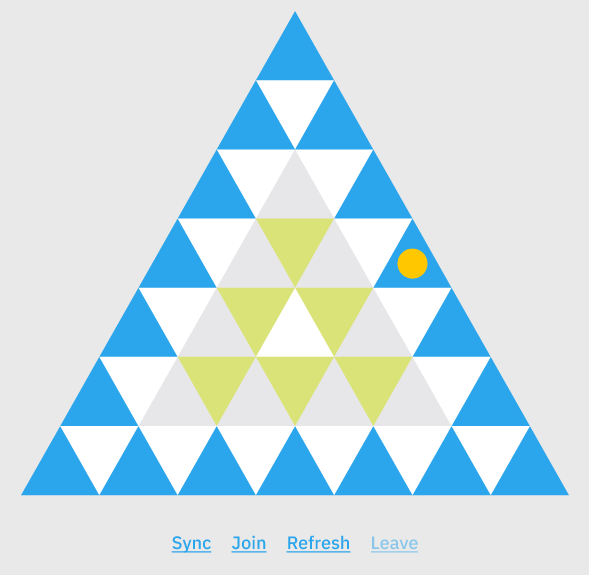

## Tripoly

We want to create a decentralized board-game on Tezos, to educate people about renewable and sustainable projects in a playful and interactive way. We want to disrupt the game idea of Monopoly and turn its values around, from capitalism and re-shape it for the future of web3 to an open source knowledge game using the conventions and the features of the metaverse.

This is the project presentation pdf: [Tzconnect_hackathon_2021_Klodie_&_Marcel.pdf](Tzconnect_hackathon_2021_Klodie_&_Marcel.pdf)

Each playing field represents a room. An AR experience as the asset of the NFT associated with that field. Maybe we can mint .USDZ and iPhone users can directly jump in the virtual world. These models are interactive.

### Deployment

The most recent contract is deployed here https://better-call.dev/hangzhou2net/KT19hqf8T654T3sFxRJpsULTtimqyGYK7Lhk

The frontend is running here: https://tripoly.vinzenzaubry.com/

A basic video of how to use it here: [images/walkthrough_video.mp4](images/walkthrough_video.mp4)

### Code

Our game contract source code is [here](./tripoly/main.mligo)

The frontend code is [here](/webapp/)

#### Endpoints

##### Join(str)
Join the game and pass your player name

##### Leave
Leave the game

##### Dice(rolled_number : nat)
Once you are in the game (joined) you can roll the dice and advance on the playing field

##### Support
You can support the project of your current position. This token has an amount, you will buy the nft.

##### Clock
A debug endpoint. Call this in order to entire step the game forward. This force-steps inactive players one step forward. The game is round-based, meaning you can only roll the dice when everybody else has finished the previous round already.

##### SetField(idx : nat, stock : nat, addr : address, price : tez, co2_multiplier : nat)
An admin-endpoint for now. The admin can set a new token for a field.

##### Payout
An admin-endpoint. Sends balance from the contract to the admin.

##### Refill
A cosmetic public endpoint to send xtz balance to the contract.

### Next steps for making the game a real product

    1. balance game parameters (timeout, bounty, amount of playing fields, nft prices etc)
    2. per field 3 nfts with multiple editions ( research, prototype, startup etc)
    3. activity fields (go back to start without bounty etc), to avoid/reduce the possibility for people to play only to get tezos by making rounds
    4. market place to trade supported projects (secondary market)
    5. project submission mechanism. see below
    6. fix random number problem
    7. frontend needs to be responsibe and dynamic
    8.  create leaderboard of people who saved the most co2 by supporting projects
    9.  branding & communication to talk about the project
    10. how to add contract metadata to origination? (TZIP-16)

#### Project submission mechanism
Once all projects from a field are sold out, it's time to refill the game, so it can continue. There will be a separate mechanism for that, a submission contract.

The submission contract will be a superset of a FA2 token minter. Any player can mint a token that includes basic data as name, description, 3d file (usdz), image and price in XTZ. This token will be minted and after an approval stage with a curator (dao, voting?) placed in a waiting queue. Once a playing field / a project has been supported by a player, it is sold out and will automatically be replaced by a new project from the waiting queue of new project.

### Notes

We are making use of OpenMinter to pre-mint tokens. In the future these will be minted by players of the game.

For this we mint tokens, send them by hand to our contract. Before we do that, we need to mint all tokens and send them to the storage of out contract after we deployed it with the storage containing all our minted token addresses.
Check [the storage file](./tripoly/main_storage.mligo)
Once this is complete it's possible to interact with our contract via it's 'Support' entry point. This call needs to have the same amount associated than the price of the token. A playing field can be re-filled with a new token via the SetField endpoint.

### questions

    2. how to make a fake pseudo random nr somehow?
    3. how to sync all players, how long is a "round", how to timeout and what kind of bounties for "passive" playing (by joining the game and not rolling the dice, afk, etc)?
       1. how to make sure the others can continue playing?
    4. how to write tests for this?!
    5. How do we force ipfs download as .usdz file fromt frontend?
    6. Can openMinter make it possible to wrap a file in a folder, so it can be downloaded easily with the existing file extension? Like https://infura-ipfs.io/ipfs/bafybeichybrqgboixxgcf4hgnxzmcgxsolwqhtwudyruze6crawka2sad4

### integration tests?!

    ligo dry-run main.mligo main 'Join("Marcel")' "`cat main_storage.mligo`" --sender=tz1MEiHXRpHFmptzJyx4taqCmTHAYbcLpZUi --balance=10 --now='2021-01-01T10:10:10Z'
    ligo dry-run main.mligo main 'Leave()' "`cat main_storage.mligo`" --sender=tz1MEiHXRpHFmptzJyx4taqCmTHAYbcLpZUi --balance=10 --now='2021-01-01T10:10:10Z'
    ligo dry-run main.mligo main 'Dice(6n)' "`cat main_storage.mligo`" --sender=tz1MEiHXRpHFmptzJyx4taqCmTHAYbcLpZUi --balance=10 --now='2021-01-01T10:10:10Z'
    ligo dry-run main.mligo main 'Support()' "`cat main_storage.mligo`" --sender=tz1MEiHXRpHFmptzJyx4taqCmTHAYbcLpZUi --balance=10 --now='2021-01-01T10:10:10Z' --amount=1
    ligo dry-run main.mligo main 'Payout(10tz)' "`cat main_storage.mligo`" --sender=tz1MEiHXRpHFmptzJyx4taqCmTHAYbcLpZUi --balance=10 --now='2021-01-01T10:10:10Z'
    ligo dry-run main.mligo main 'Refill()' "`cat main_storage.mligo`" --sender=tz1MEiHXRpHFmptzJyx4taqCmTHAYbcLpZUi --balance=10 --now='2021-01-01T10:10:10Z' --amount=1
    ligo dry-run main.mligo main 'Clock()' "`cat main_storage.mligo`" --sender=tz1MEiHXRpHFmptzJyx4taqCmTHAYbcLpZUi --balance=10 --now='2021-01-01T10:10:10Z'

### Team members

    Marcel Schwittlick http://schwittlick.net/
    Claude-Edwige Zengbé https://www.klodiezengbe.com/
    Vinzenz Aubry https://vinzenzaubry.com/

Berlin, 2021