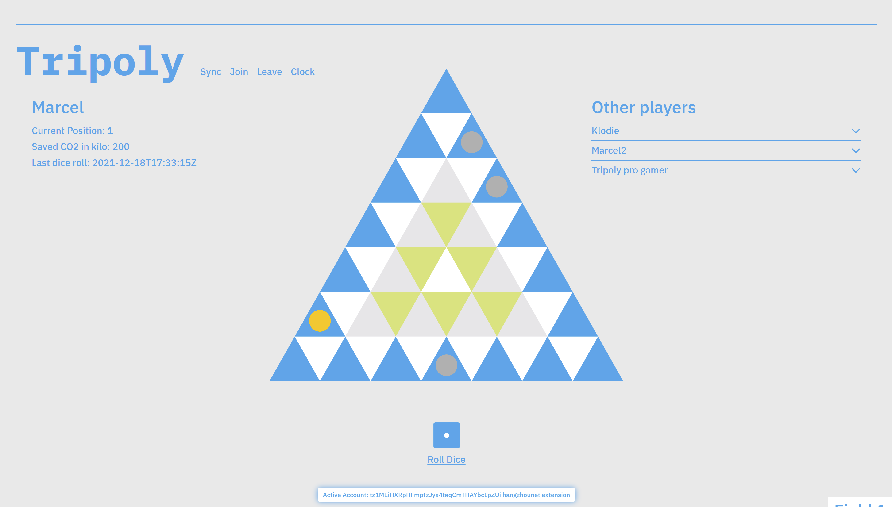
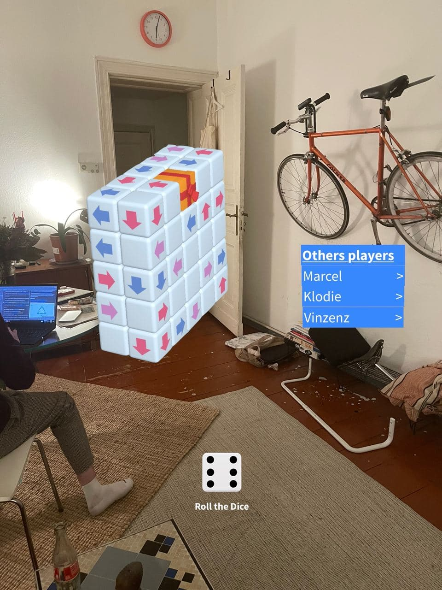

## TRIPOLY

Tripoly is a round based, decentralised and multiplayer board-game on the Tezos Blockchain.The aim of this game is to educate about renewable and sustainable projects in a simple, playful and interactive way. 

Some of you may know the Anti-Monopoly games. We love the idea of being Tripoly is another disruptive form of Anti-monopoly. We turn the values game of Monopoly around and re-shape it for the future of web3 : from a capitalistic dynamic to an open source knowledge game using the conventions and the features of the metaverse. 

Are you ready? 🎲

### How to play this game

The game interface of tripoly is a triangle composed of 18 triangular fields. In Tripoly, each field is a sustainable project. Each player advances through the game by rolling the dice. The players advance clockwise, only on the edge of the board

Once a player steps on a field, they have access to the content of this field.
As a player, you are are shown the project which is saved at each position 
At this point, you can discover the project and have different options to support the project.
Each project has 3 levels of support : Research, Prototype, Start-up
You can support the project by buying the NFT related to and also receive a CO2 balance certificate.

Keep playing and going over the start, players are rewarded by two bounties : 
- Tezos (1ꜩ) 
- CO2 saved balance

NFTs : 

In Tripoly, the NFTs that players acquire have been designed to be interactive and fun. You can play, manipulate and admire your NFT anywhere and at any time. 

There is a token on each field which contains an augmented reality world. A different way of owning an NFT that bridges the gap between the real world and the metaverse.
 
CO2 Balance Certificate : 
Each project contributes to optimizing consumption and living patterns and tends to help reduce the carbon footprint. 

The more you support a project, the more you contribute to reducing the carbon footprint. Each contribution made by the players represents a different carbon footprint saving. 

The CO2 balance is calculated at each round based on how many projects you support as a player and how many NFT you bought. 

#### Setup : 
- Set up your profile and personal wallet on a dedicated platform (Temple Wallet, Kukai etc) (link to how to settle your wallet)
- Sync your wallet to the game by clicking on “sync”. 
- Join the game to be listed as a player and to be able to roll the dice

#### Course of one round
- You roll the dice
- Your player figure advances depending on the dice’s number
- The NFT shows you which project you have
- Read the description
- You can join the AR world by scanning the QR code
- You can support the project by clicking on the “support” button. This will buy the NFT.

⚠️ NB:
Because Tripoly is a round based game and to allow everyone to play fair, players can roll the dice once per 24h. The game is not about making the round as fast as possible but to discover, understand the projects, and have time to explore the AR world. For development purposes, we have a "Clock" endpoint. This will advance all players who have no rolled the dice in the current round. After "Clock" a new round starts and everybody can roll the dice again. 

### Links

The frontend is running here: https://tripoly.vinzenzaubry.com/

Video of the gameplay demo https://www.youtube.com/watch?v=iNEPBtHtyR0

The most recent contract is deployed here: https://better-call.dev/hangzhou2net/KT19hqf8T654T3sFxRJpsULTtimqyGYK7Lhk

Our source code of the contract is [main.mligo](tripoly/main.mligo)

The frontend source code is in the submodule "webapp": https://github.com/vin-ni/tripoly-frontend

More development information in [DEVELOPMENT.md](DEVELOPMENT.md)

A list of all projects that are featured within Tripoly are listed here https://docs.google.com/spreadsheets/d/14lT92V5NXHRhLmGlB0faUw2Ako9qKdmIUlRZWAojz_0/edit?usp=sharing

### Next Steps:

#### Global improvement:
- Make the entire board game in 3D. making it possible to play in AR/VR. (see image blow) 
- Submission mechanism: Make possible for people to submit project for the fields whose all possible NFT’s have been purchased, based on specific criterias (Curation, DAO, Multisign Wallet) 
- Create the NTF for the 2 other levels of support (Prototype, Start-up). Having multiple editions of each NTF in each field. 
- Add activity fields (go back to start without bounty etc., to avoid/reduce the possibility for people to play only to get tezos by making rounds)
- Mobile app of the game
- Do we want a leaderboard of players who saved the most CO2 by supporting the projects?
- Challenge the CO2 balance Certificate
- Build a community around the game

This is a sketch of the Tripoly playing board in Augmented Reality:

#### Technical improvement:
- Make an additional contract allowing users to mint NFT as a submission. 
- Balance game parameters (timeout, bounty, amount of playing fields, NFT prices, Marketplace fee etc)
- Market place to trade supported projects (secondary market). Players will be able to then sell, trade or buy back NFTs from the game.
- Fix random number generator problem (How to generate a random number within the contract?) 
- How to add contract metadata to origination? (TZIP-16)
- Write unit tests for the contracts?
- Refactor contract code for improved maintainability

#### Project submission mechanism
Once all projects from a field are sold out, it's time to refill the game, so it can continue. There will be a separate mechanism for that, a submission contract.

The submission contract will be a superset of a FA2 token minter. Any player can mint a token that includes basic data as name, description, 3d file (usdz), image and price in XTZ. This token will be minted and after an approval stage with a curator (dao, voting?) placed in a waiting queue. Once a playing field / a project has been supported by a player, it is sold out and will automatically be replaced by a new project from the waiting list.

### Team members

    Marcel Schwittlick 
    Artist & Developer
    http://schwittlick.net/
    Twitter: https://twitter.com/schwittlick_

    Klodie Zengbé 
    Content creator, Photographer & Strategist    
    https://www.klodiezengbe.com/
    Twitter: https://twitter.com/klod_i_e

    Vinzenz Aubry 
    Artist & Developer
    https://vinzenzaubry.com/
    Twitter: https://twitter.com/vinberto

Berlin, 2021